---
## Author
author:
  name: Баженов Тимур
  degrees: DSc
  orcid: 0000-0002-0877-7063
  email: cool.jatik@gmail.com
  affiliation:
    - name: Российский университет дружбы народов
      country: Российская Федерация
      city: Москва
      address: ул. Миклухо-Маклая, д. 6

## Title
title: "Шаблон отчёта по внешнему курсу (Безопасность в сети)"
license: "CC BY"
---

# Безопасность в сети

### Как работает интернет: базовые сетевые протоколы:

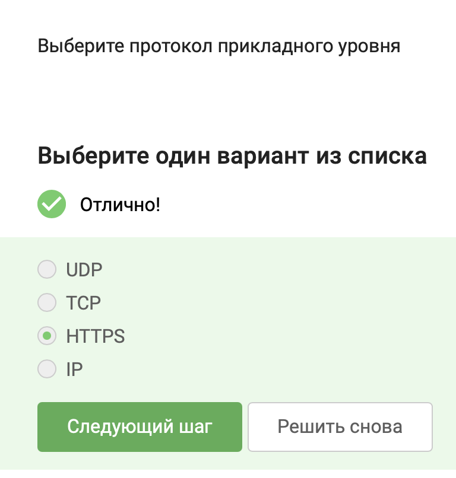

HTTPS — работает поверх TCP и относится к прикладному уровню модели OSI (передаёт конкретные данные приложений — веб-страницы, файлы, API-запросы).
UDP и TCP — это транспортный уровень (обеспечивают доставку, но не формат данных).
IP — сетевой уровень (маршрутизация пакетов).

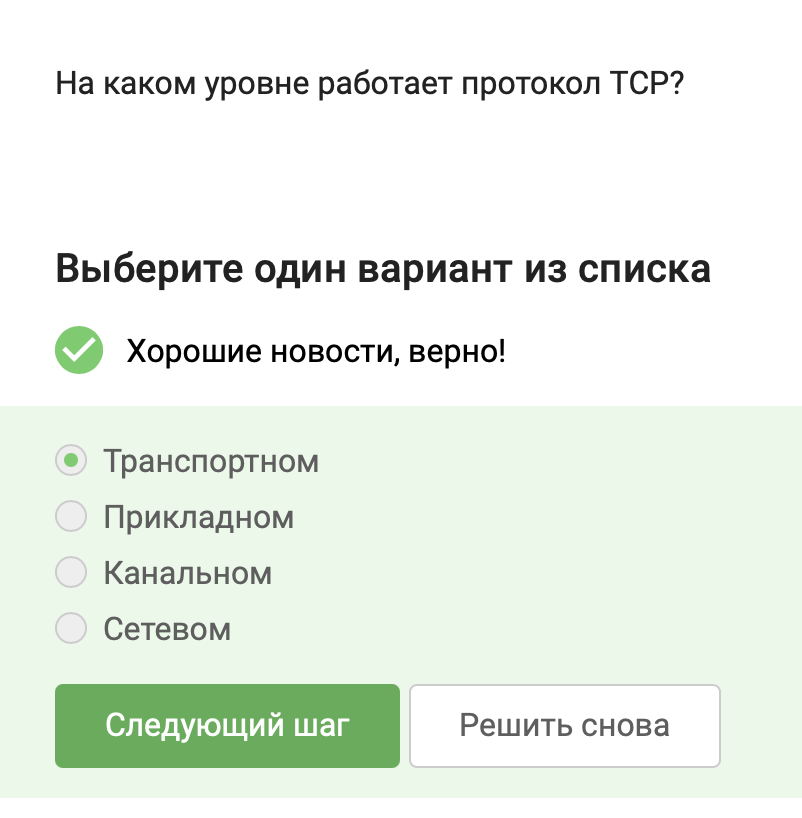

TCP (Transmission Control Protocol) работает на транспортном уровне. Его задачи: обеспечение надёжной доставки, управление потоком, сегментация данных, установление соединения.

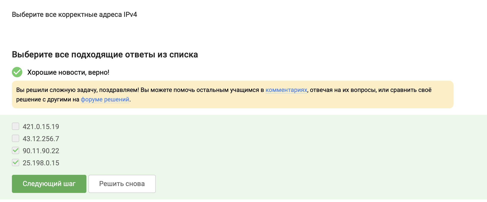

IPv4-адрес состоит из четырёх чисел (октетов), каждое от 0 до 255 включительно.

421.0.15.19 — первый октет 421 > 255 → неверно
43.12.256.7 — третий октет 256 > 255 → неверно
90.11.90.22 — все октеты в диапазоне 0–255 → верно
25.198.0.15 — все октеты в диапазоне 0–255 → верно

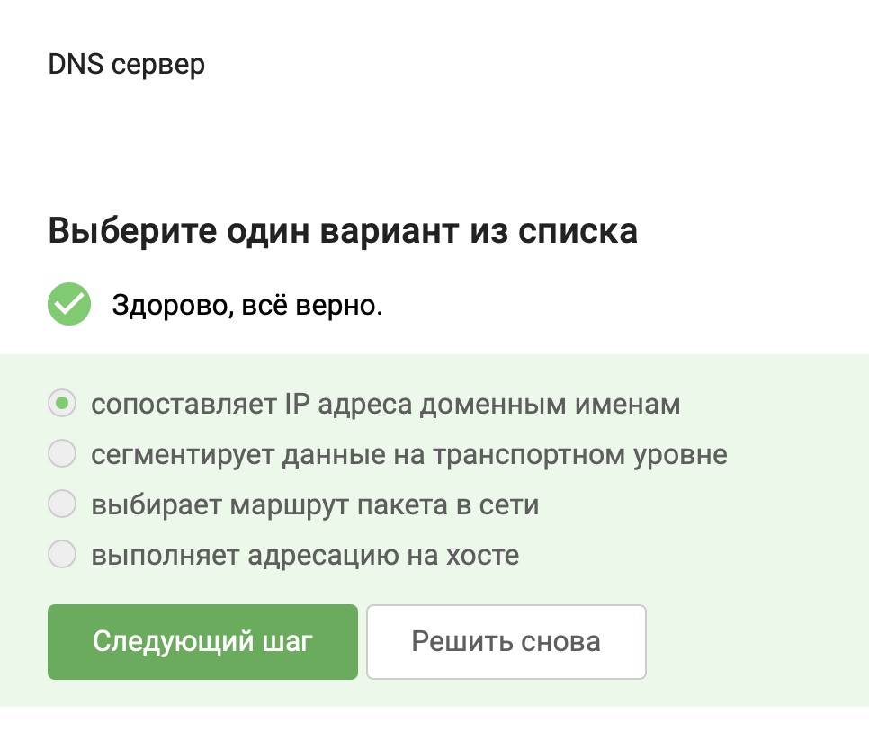

DNS (Domain Name System) выполняет функцию преобразования доменных имён (например, google.com) в IP-адреса (например, 142.250.185.46) и обратно. Остальные варианты относятся к другим уровням: сегментация данных - TCP, выбор маршрута - IP (маршрутизация), адресация на хосте - ARP или локальная настройка сети.

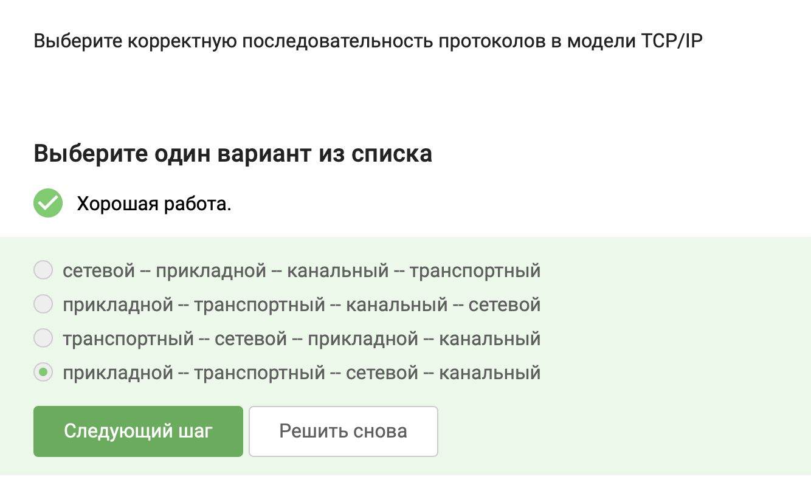

Модель TCP/IP (упрощённо) сверху вниз выглядит так:

Прикладной уровень (HTTP, DNS, FTP)
Транспортный уровень (TCP, UDP)
Сетевой уровень (IP, маршрутизация)
Канальный уровень (Ethernet, Wi-Fi)

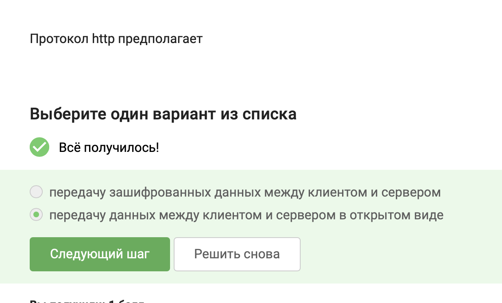

HTTP (HyperText Transfer Protocol) — это протокол передачи гипертекста, который работает в открытом (незашифрованном) виде. Данные передаются в виде обычного текста, что делает их уязвимыми для перехвата и прослушивания.

Для шифрования используется HTTPS (HTTP + TLS/SSL), который как раз обеспечивает зашифрованную передачу данных между клиентом и сервером.

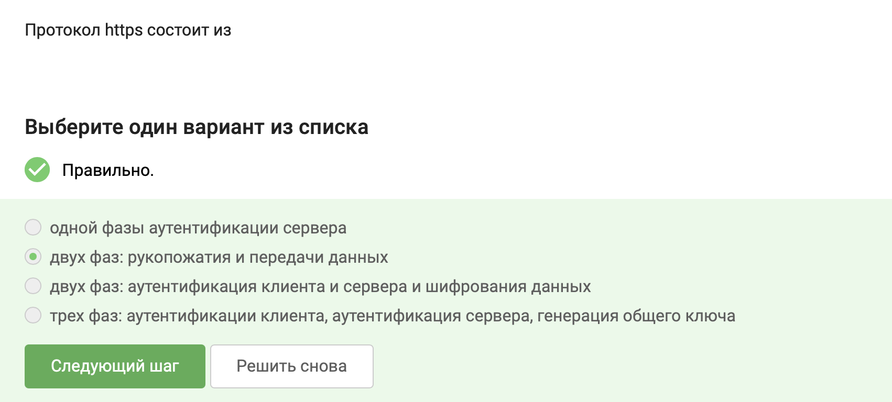

HTTPS (HTTP поверх TLS) работает в два основных этапа:

Рукопожатие (TLS Handshake) — стороны согласовывают алгоритмы шифрования, обмениваются сертификатами, аутентифицируют сервер (иногда и клиента), вырабатывают общий секретный ключ.
Передача данных — сами данные HTTP шифруются этим ключом и передаются.

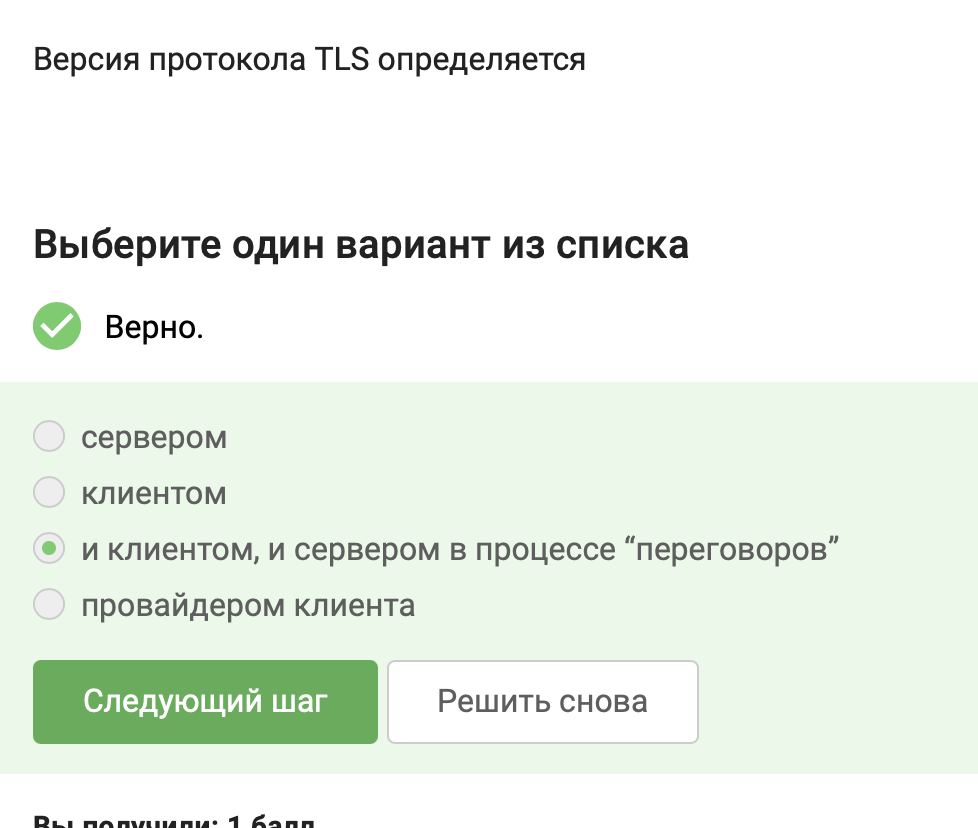

При установлении TLS-соединения клиент отправляет список поддерживаемых версий TLS (например, TLS 1.2, 1.3), а сервер выбирает наиболее новую версию, которую поддерживают оба. Это называется согласованием (negotiation). Ни клиент, ни сервер не диктуют версию в одностороннем порядке.

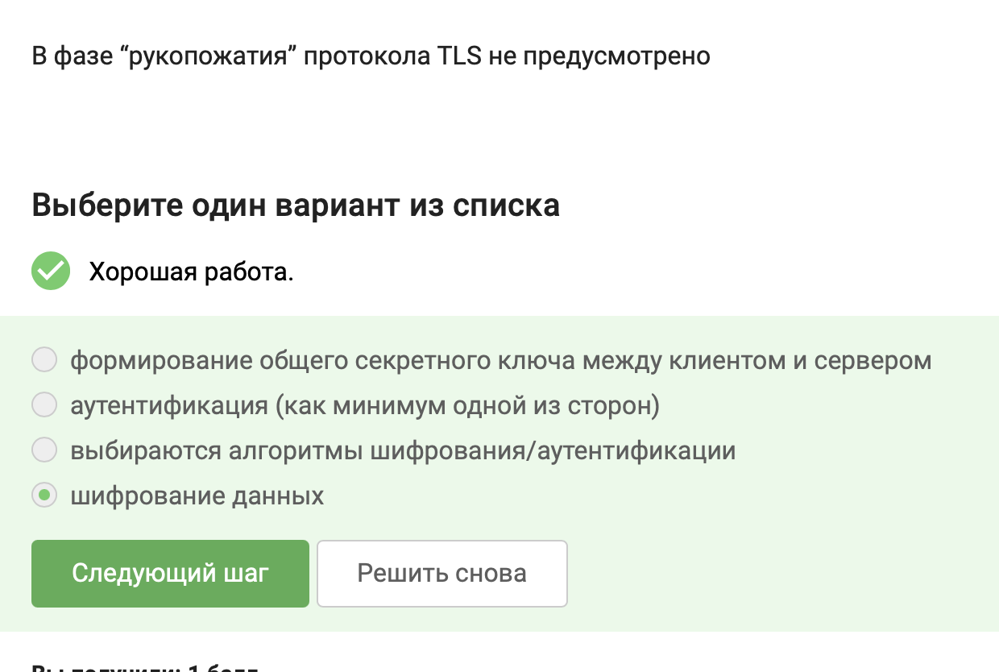

В фазе "рукопожатия" TLS происходит:

формирование общего секретного ключа (через обмен ключами)
аутентификация сервера (и опционально клиента) с помощью сертификатов
согласование алгоритмов шифрования и аутентификации (Cipher Suite)
Шифрование самих данных начинается уже после завершения рукопожатия, когда общий секретный ключ выработан и стороны переходят к защищённой передаче прикладных данных.

### Персонализация сети:

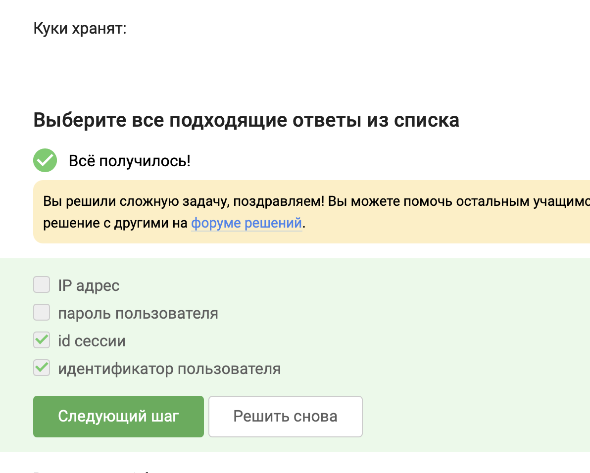

Куки обычно хранят:

id сессии — уникальный идентификатор текущего сеанса работы пользователя с сайтом
идентификатор пользователя (например, user_id) — для узнавания пользователя при повторных визитах
Что не хранят в куки (как правило):

IP адрес — это адресная информация уровня сети, хранится на сервере в логах, а не в куки браузера
пароль пользователя — это критически важная информация, пароли в открытом виде в куки никогда не сохраняются по соображениям безопасности

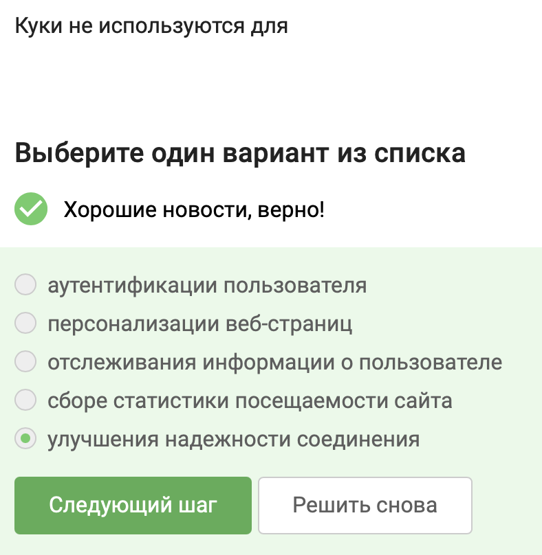

Куки применяются для:

аутентификации пользователя (проверка, что пользователь уже входил в систему)
персонализации веб-страниц (запоминание настроек, темы, языка)
отслеживания информации о пользователе (аналитика, рекламные трекеры)
сбора статистики посещаемости сайта (счётчики, Google Analytics)
Надёжность соединения (устойчивость, повторная отправка потерянных пакетов, управление потоком) — это задача транспортного уровня (TCP), к куки она не имеет отношения.

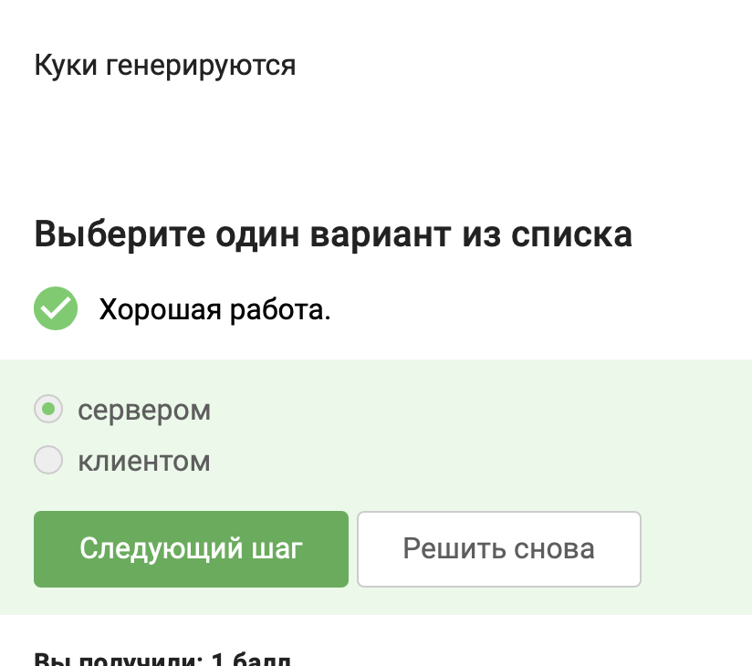

Куки создаются на стороне сервера. Сервер включает в HTTP-ответ заголовок Set-Cookie, после чего браузер (клиент) сохраняет эту куку и возвращает её в последующих запросах в заголовке Cookie. Клиент сам куки не генерирует (кроме клиентских куки через JavaScript document.cookie, но это нестандартный сценарий). По заданию предполагается классический ответ — сервер.

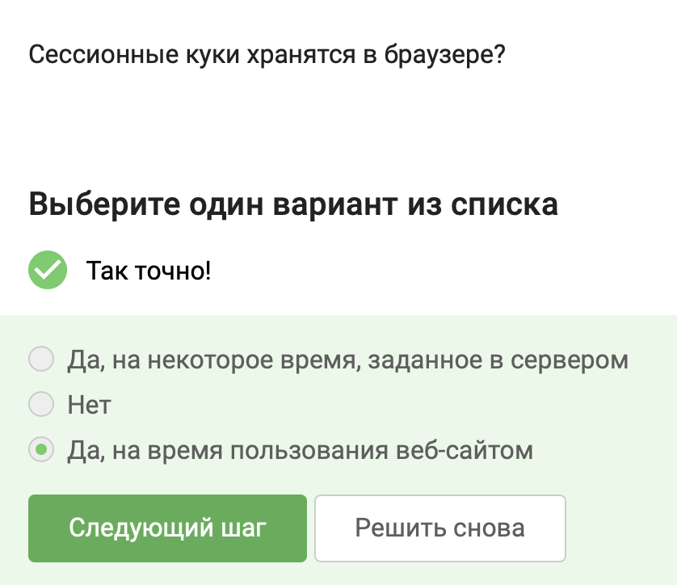

Сессионные куки (session cookies) существуют только пока открыт браузер и активна сессия. Они не имеют заданной даты истечения (Max-Age/Expires), поэтому при закрытии браузера удаляются. Вариант "Да, на некоторое время, заданное сервером" — это про постоянные куки (persistent cookies), у которых срок жизни задаётся явно.

### Браузер TOR. Анонимизация

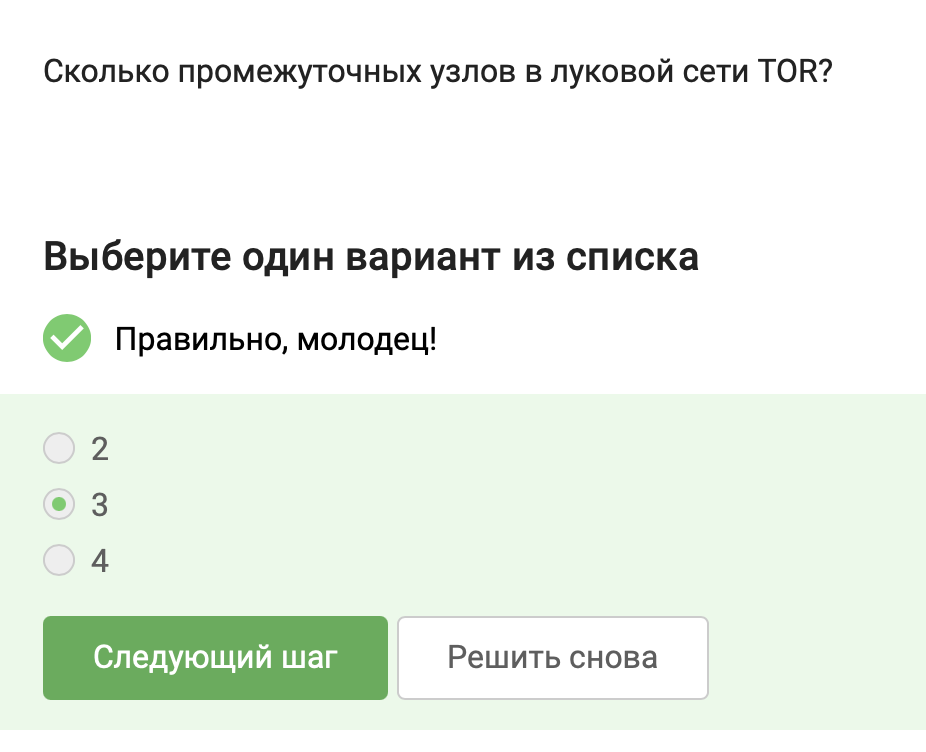

Классическая луковая маршрутизация в TOR использует три узла:

Входной (охранный) узел — guard node
Промежуточный узел — middle node
Выходной узел — exit node
Из них промежуточным формально является только один (средний).

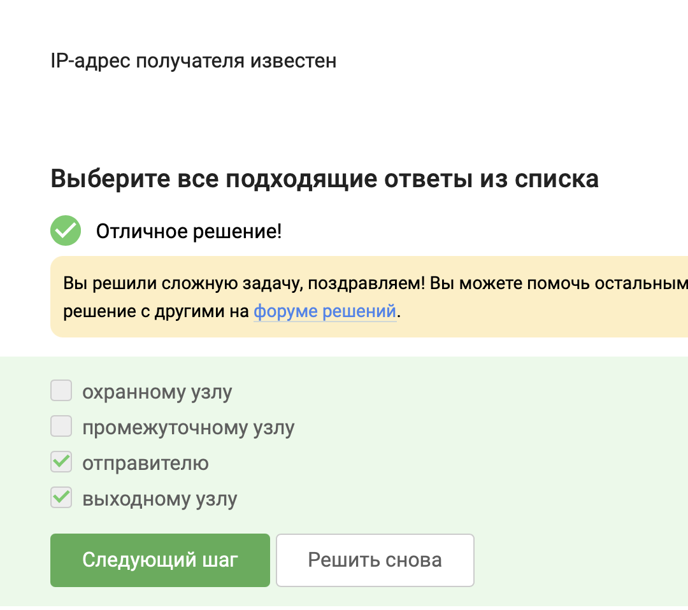

Отправитель знает IP-адрес получателя, так как он сам отправляет данные этому адресату.
Выходной узел — последний в цепочке, именно он устанавливает непосредственное соединение с получателем и, следовательно, знает его IP-адрес.
Кому не известен:

Охранный узел знает только отправителя и следующий узел, но не конечного получателя.
Промежуточный узел знает предыдущий и следующий узел, но не знает ни отправителя, ни получателя.

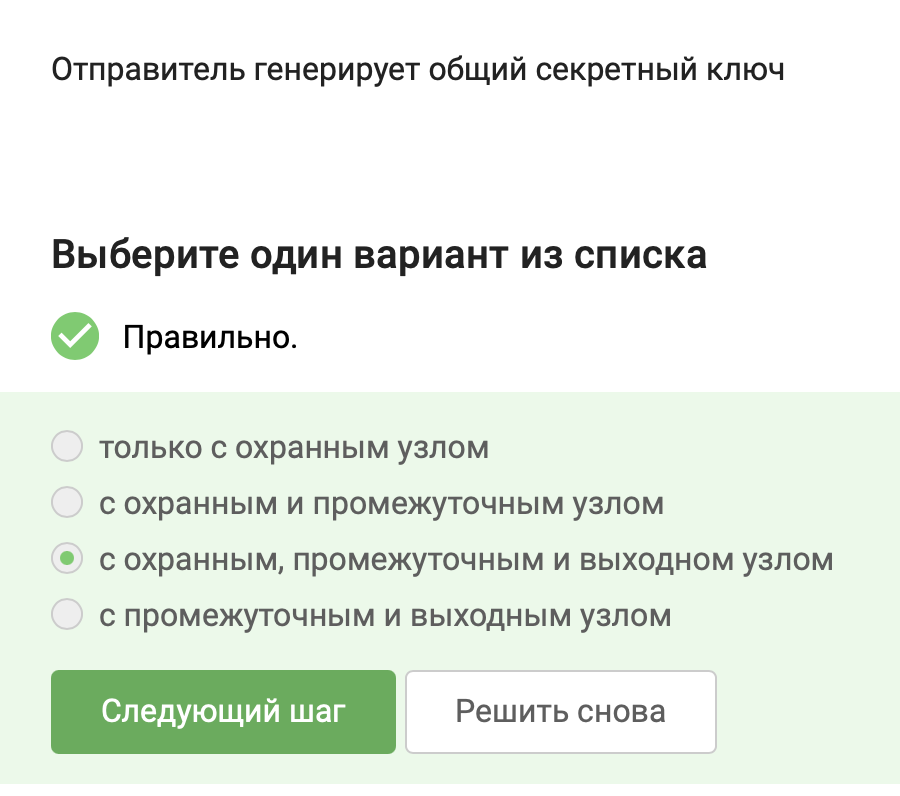

При установлении лукового соединения отправитель генерирует отдельные сессионные ключи для каждого узла в цепочке. Это делается для того, чтобы каждый слой шифрования мог быть снят только соответствующим узлом. Ключи генерируются со всеми тремя узлами: охранным, промежуточным и выходным.

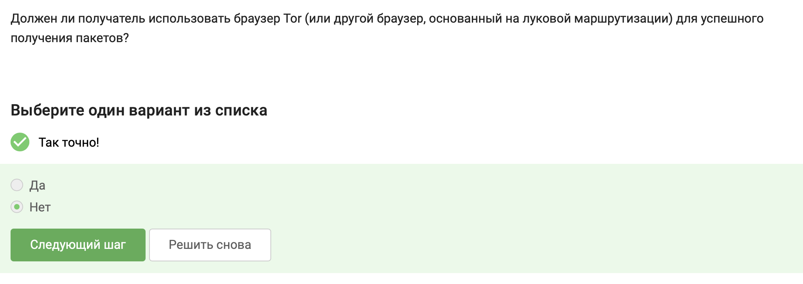

Получатель может быть обычным сервером или пользователем в интернете, не использующим TOR. Луковая маршрутизация защищает только отправителя. Выходной узел TOR отправляет запрос к получателю как обычный клиент из обычного интернета. Получатель видит IP-адрес выходного узла, а не отправителя. Специальный браузер получателю не нужен.

### Беспроводные сети Wi-fi

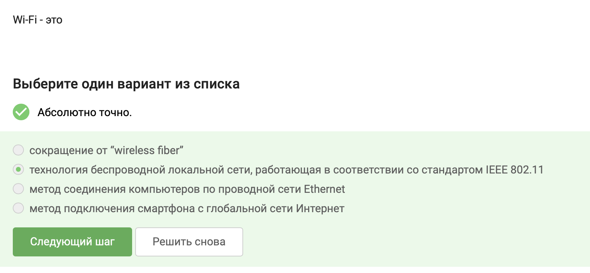

Wi-Fi — это торговая марка и технология беспроводной связи, основанная на стандартах IEEE 802.11. Остальные варианты неверны:

«wireless fiber» — выдумка, не существует
проводная сеть Ethernet — это про провода, не про Wi-Fi
подключение смартфона к глобальной сети — слишком узко и неполно

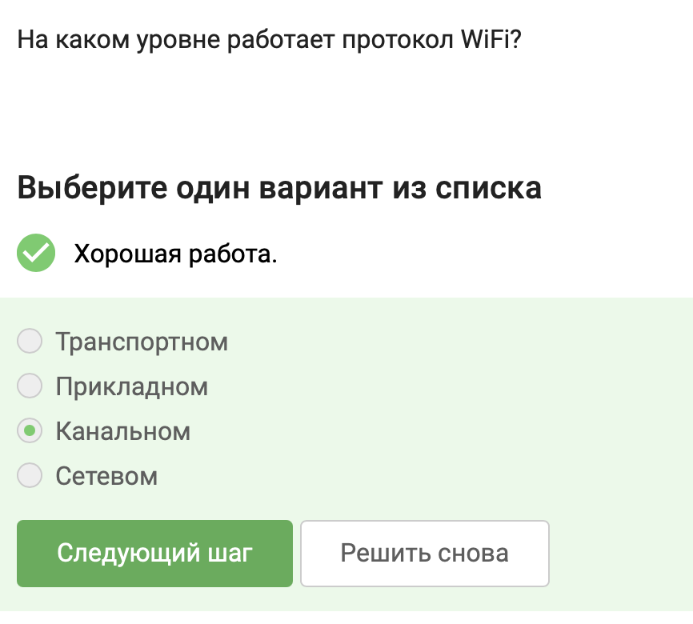

Wi-Fi (стандарт IEEE 802.11) работает на канальном уровне модели OSI. Он отвечает за передачу кадров между устройствами в одной локальной сети, управление доступом к среде (CSMA/CA), физическую адресацию (MAC-адреса).
Транспортный, сетевой и прикладной уровни — выше.

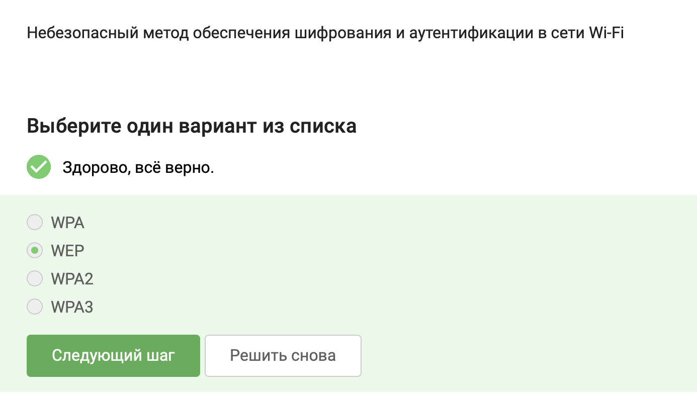

WEP (Wired Equivalent Privacy) — устаревший и небезопасный протокол. Его ключи шифрования слабые, легко взламываются за минуты.

WPA, WPA2, WPA3 — более безопасные протоколы (WPA3 — самый современный).

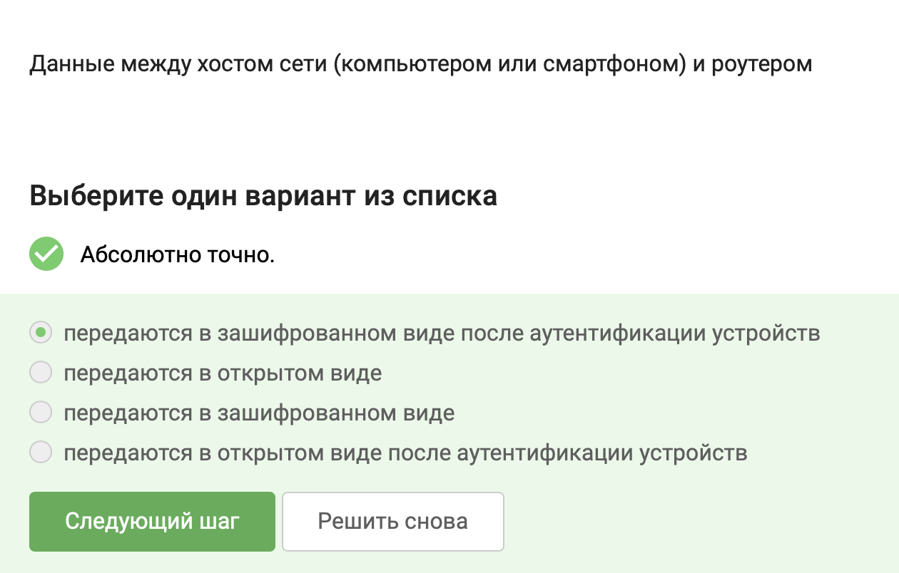

В современной защищённой Wi-Fi сети сначала происходит аутентификация (например, ввод пароля), затем вырабатываются ключи шифрования, и только после этого данные передаются в зашифрованном виде. Если сеть открытая (без пароля), то данные передаются в открытом виде, но в вопросе подразумевается общий случай защищённой сети.

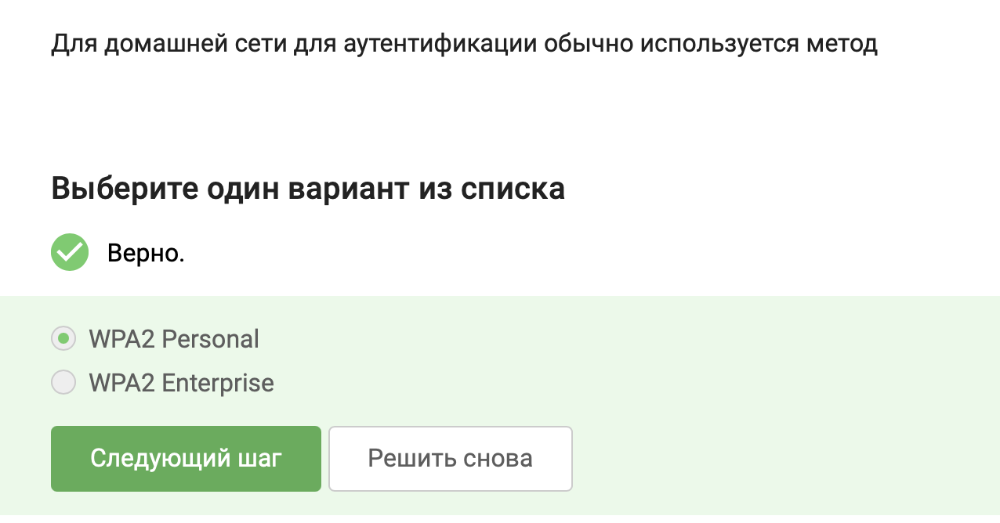

WPA2 Personal (он же WPA2-PSK) использует общий пароль (Pre-Shared Key) для всех устройств в сети. Это стандарт для домашних и небольших офисных сетей.
WPA2 Enterprise применяется в крупных организациях, используется сервер аутентификации (RADIUS) и индивидуальные учётные записи для каждого пользователя. Для дома это избыточно и сложно.