---
## Author
author:
  name: Баженов Тимур
  degrees: DSc
  orcid: 0000-0002-0877-7063
  email: cool.jatik@gmail.com
  affiliation:
    - name: Российский университет дружбы народов
      country: Российская Федерация
      city: Москва
      address: ул. Миклухо-Маклая, д. 6

## Title
title: "Шаблон отчёта по внешнему курсу (Защита пк/телефона)"
license: "CC BY"
---

# Защита пк/телефона

### Шифрование диска

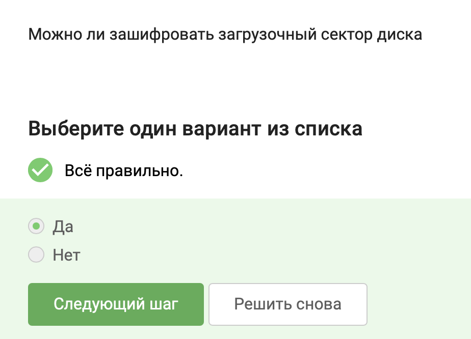

Загрузочный сектор (MBR или EFI-системный раздел) можно зашифровать, но с осторожностью. Современные средства полного шифрования диска (Full Disk Encryption), такие как BitLocker, VeraCrypt, LUKS, шифруют весь диск, включая системные области, и требуют ввода пароля до загрузки операционной системы. При этом загрузчик располагается в незашифрованном виде (или отдельном маленьком разделе), а сам загрузочный сектор как часть диска тоже шифруется.

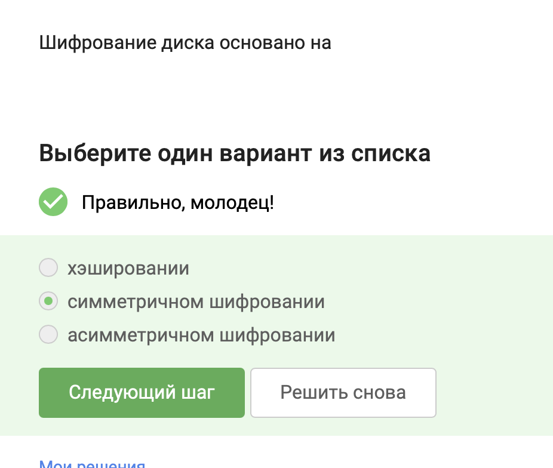

Шифрование всего диска требует высокой скорости работы. Симметричные алгоритмы (AES, Serpent, Twofish) значительно быстрее асимметричных. Обычно используется следующий подход:

Генерируется случайный симметричный ключ шифрования диска (ключ данных)
Этим ключом шифруется содержимое диска
Сам ключ шифруется асимметричным или другим ключом (например, на основе пароля пользователя)
Базовая операция шифрования данных на диске — симметричная.
Хэширование используется для проверки пароля, но не для шифрования данных.

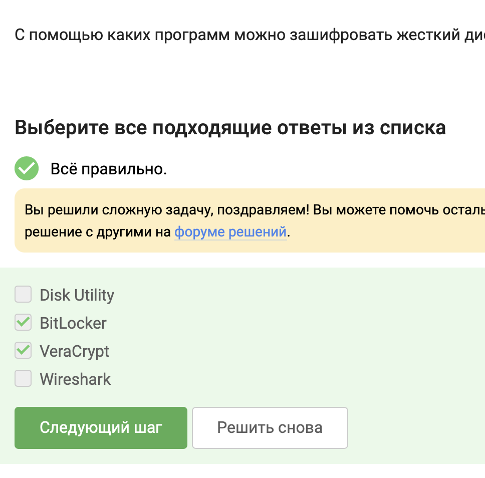

BitLocker — встроенное средство шифрования дисков в Windows (Pro/Enterprise)
VeraCrypt — бесплатная кроссплатформенная программа для полного шифрования дисков и создания зашифрованных контейнеров
Disk Utility — утилита в macOS, умеет создавать зашифрованные образы дисков (и в новых версиях — шифрование разделов)
Wireshark — это анализатор сетевого трафика, к шифрованию дисков отношения не имеет.

### пароли

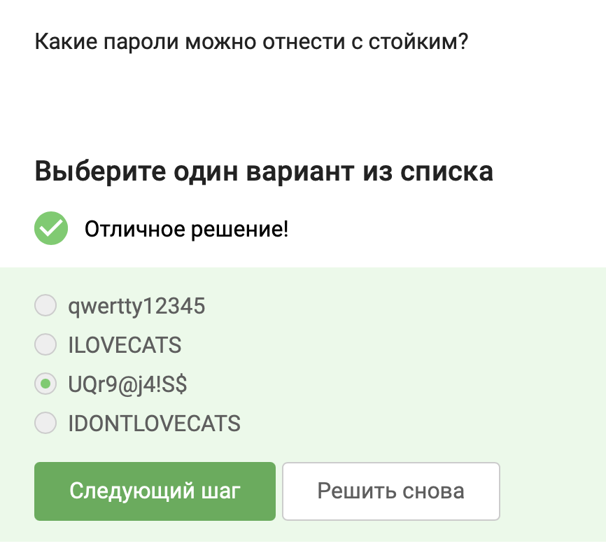

Стойкий пароль должен быть:

достаточно длинным (10+ символов)
содержать разные типы символов: заглавные и строчные буквы, цифры, специальные символы
не содержать словарных слов, простых последовательностей (qwerty), личной информации (ILOVECATS)
Разбор:

qwertty12345 — содержит клавиатурную последовательность и простые цифры
ILOVECATS — только заглавные буквы, словарное выражение
UQr9@j4!S$ — смесь регистров, цифры, спецсимволы, неосмысленный набор
IDONTLOVECATS — длинный, но только буквы (нет цифр и спецсимволов), осмысленная фраза

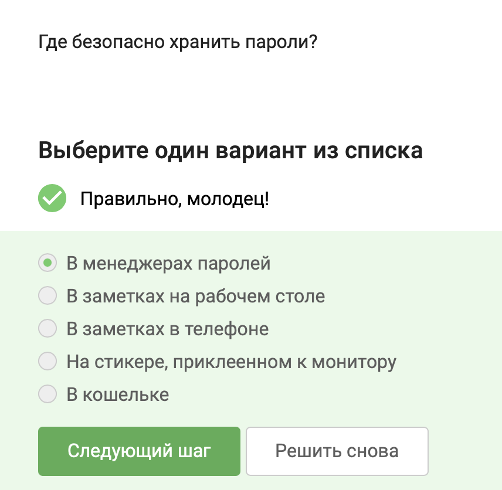

Менеджеры паролей (KeePass, Bitwarden, 1Password, LastPass) хранят пароли в зашифрованном виде, требуют мастер-пароль, синхронизируются между устройствами.

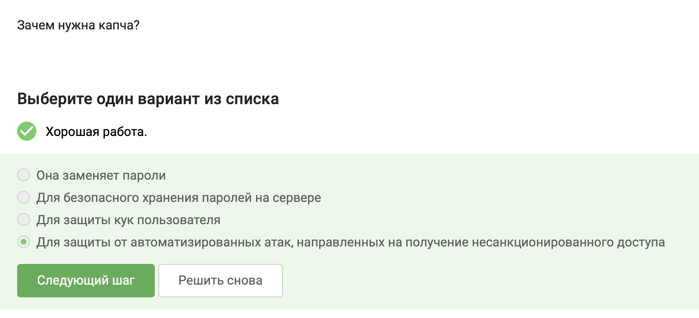

CAPTCHA различает людей и ботов. Она предотвращает:

автоматический перебор паролей (brute force)
создание множества аккаунтов ботами
накрутку голосований, спам в формах
Остальные варианты неверны: капча не заменяет пароли, не хранит пароли, не защищает куки.

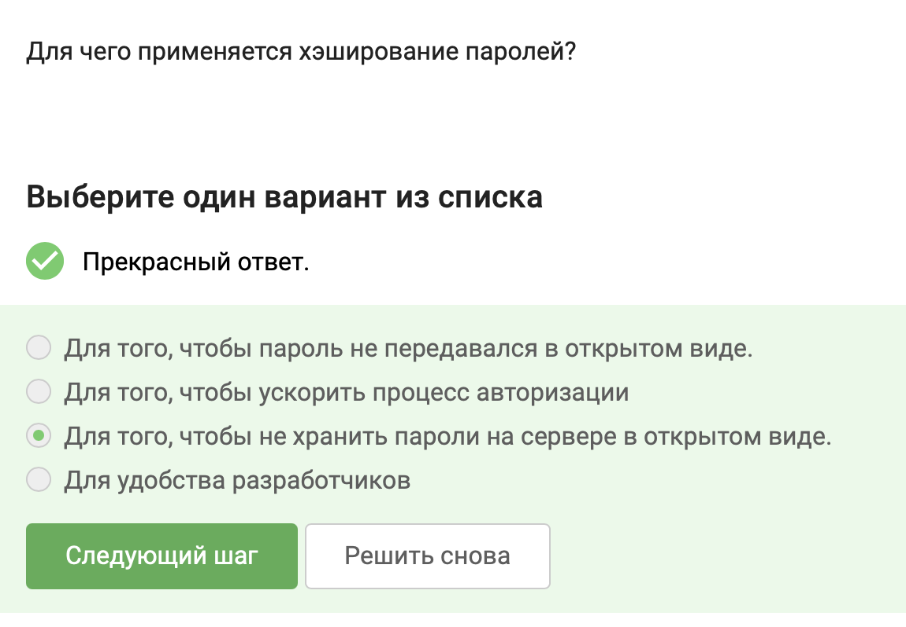

При регистрации сервер вычисляет хэш пароля (с солью) и сохраняет только хэш. При входе хэш введённого пароля сравнивается с сохранённым. Если база данных утечёт, злоумышленник не получит пароли в открытом виде (только хэши, которые сложно обратить).

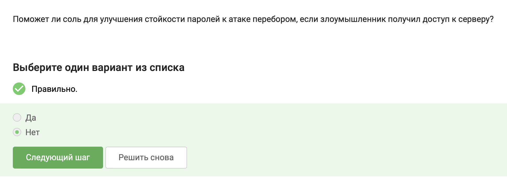

Соль защищает от использования радужных таблиц (precomputed hash tables) и от того, что одинаковые пароли у разных пользователей дадут одинаковые хэши.

Но если злоумышленник украл базу хэшей (с солями), он может перебирать пароли по одному для каждого пользователя. Соль не увеличивает энтропию слабого пароля. Атака перебором (brute force) остаётся возможной, просто становится чуть медленнее (надо перебирать отдельно для каждой соли).

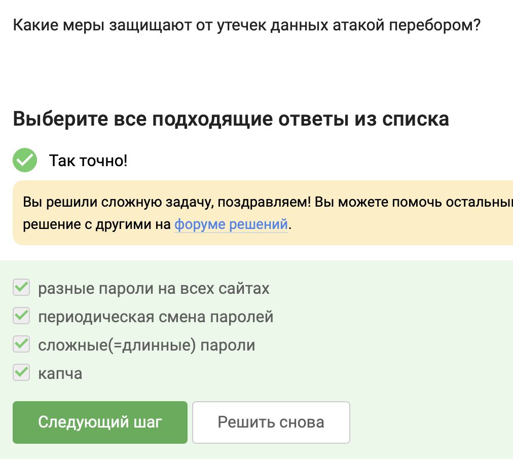

Разные пароли — если один сайт взломают, другие аккаунты не пострадают (сдерживание ущерба)
Сложные/длинные пароли — увеличивают пространство поиска, делают перебор непрактичным
Капча — не даёт автоматизировать перебор в интерактивном режиме
Периодическая смена паролей — спорный момент. Стандарты NIST больше не рекомендуют принудительную смену без признаков компрометации, так как пользователи начинают выбирать слабые предсказуемые пароли (Password1 → Password2). Сама по себе смена не защищает от перебора "здесь и сейчас" — пока пароль активен, его всё равно можно перебрать. В данном тесте этот вариант не выбран.

### фишинг

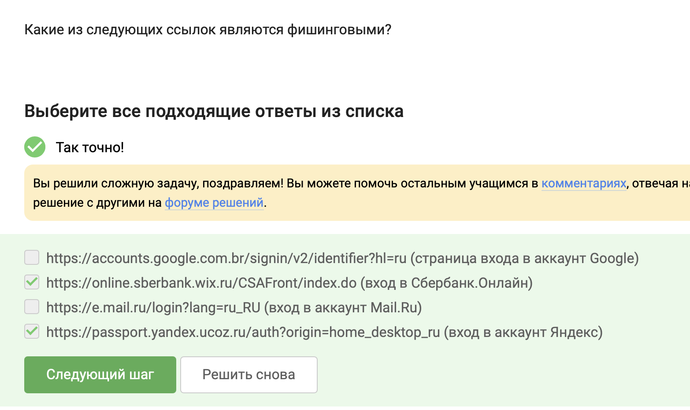

Фишинговая ссылка — это ссылка, которая ведёт на поддельный сайт, имитирующий настоящий, но расположенный на чужом домене.

Разбор каждой:

https://accounts.google.com.br/signin/... — домен google.com.br принадлежит Google (Бразилия). Это официальный домен Google, не фишинг.
https://online.sberbank.wix.ru/... — официальный домен Сбербанка — sberbank.ru или sberbank.com. wix.ru — это конструктор сайтов. Сбербанк не использует Wix для своего онлайн-банка. Это фишинг.
https://e.mail.ru/login... — домен mail.ru официальный. Вход в аккаунт Mail.ru — безопасно.
https://passport.yandex.ucoz.ru/... — официальный домен Яндекса — yandex.ru, yandex.com. ucoz.ru — бесплатный хостинг. Яндекс не использует ucoz. Это фишинг.

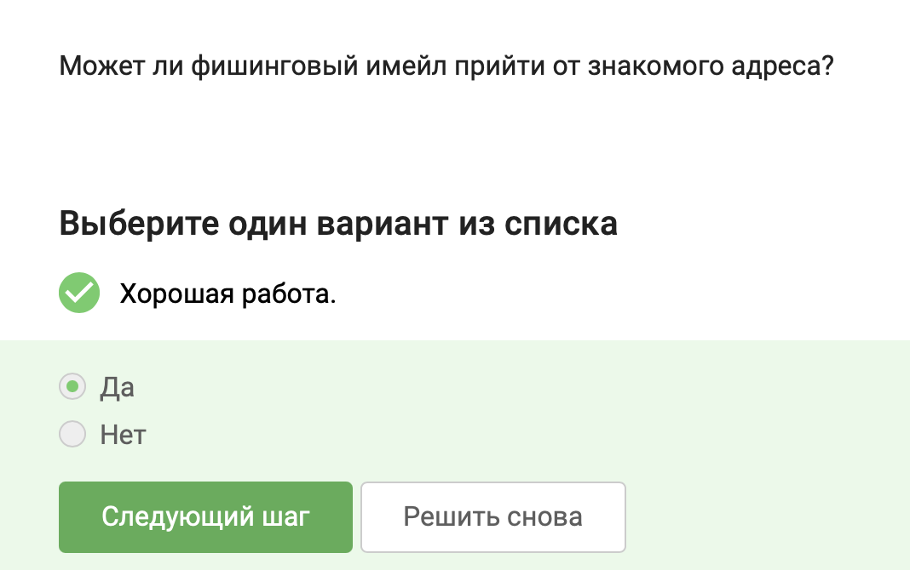

Злоумышленники могут подделать обратный адрес (spoofing) или взломать ящик знакомого человека. Взломанный аккаунт друга начинает рассылать фишинговые письма от его имени. Именно поэтому фишинг так опасен — письмо может прийти с абсолютно реального, знакомого вам адреса.

### вирусы

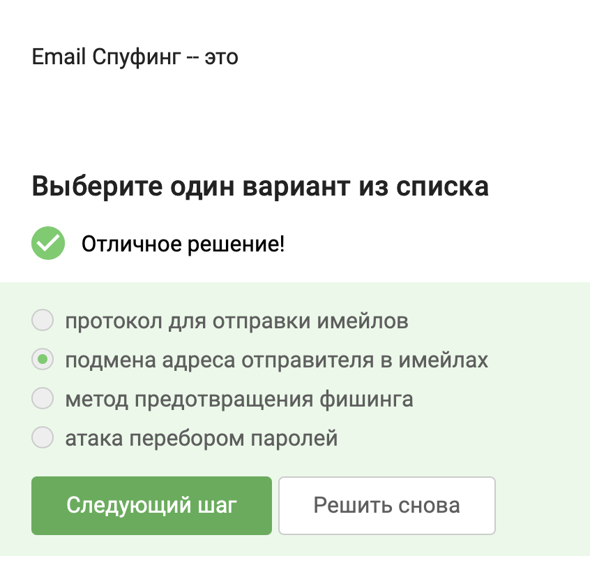

Спуфинг (spoofing) в контексте электронной почты — это техника, при которой злоумышленник подделывает заголовки письма, чтобы оно выглядело так, будто отправлено с другого адреса (например, от имени банка, коллеги, друга). Цель — обмануть получателя и заставить его открыть вложение, перейти по ссылке или передать данные.

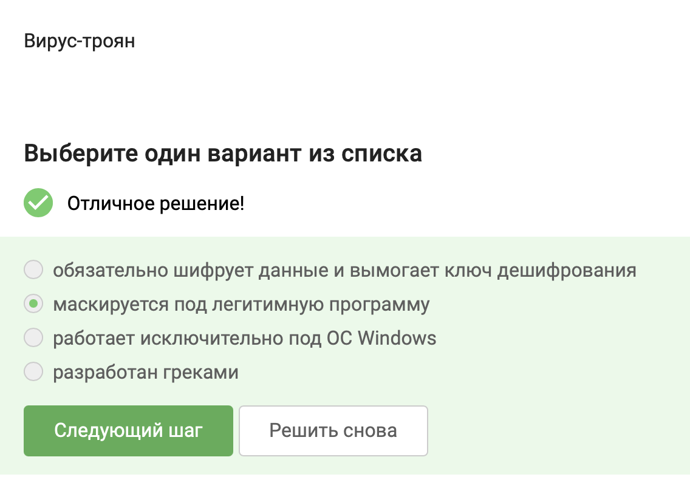

Троян (троянская программа) — это вредоносное ПО, которое выдаёт себя за полезную или интересную программу (игру, установщик, антивирус, кряк), но при запуске выполняет скрытые вредоносные действия. Название происходит от Троянского коня.

### Безопасность мессенджеров

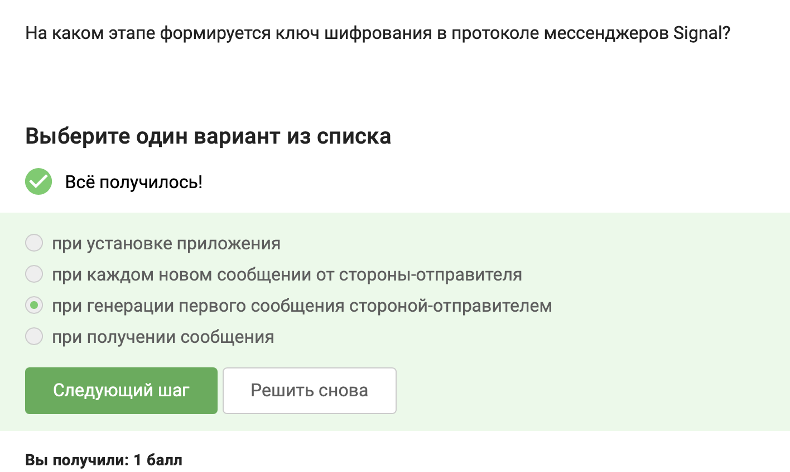

Протокол Signal использует криптографию на основе эллиптических кривых и протокол тройного обмена ключами (X3DH) для асинхронного установления сессии. Ключи не генерируются при установке приложения (там создаются только долговременные ключи). При отправке первого сообщения отправитель загружает с сервера предварительные ключи получателя и вычисляет общий ключ сессии (сессионный ключ). Последующие сообщения в той же сессии используют уже сформированный ключ.

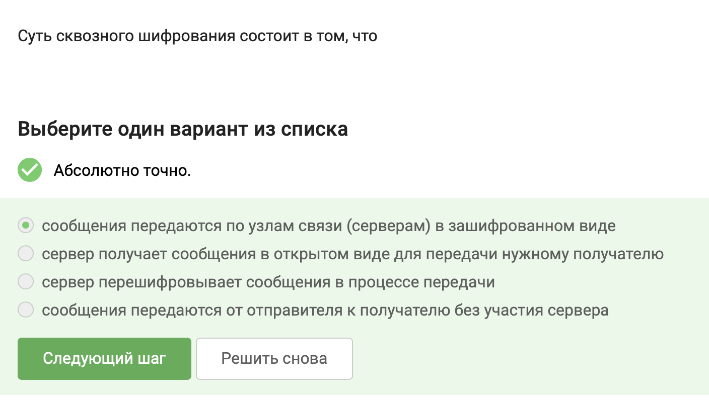

Сквозное шифрование (end-to-end encryption, E2EE) означает, что сообщение шифруется на устройстве отправителя и расшифровывается только на устройстве получателя. Промежуточные узлы (серверы мессенджера, провайдеры, маршрутизаторы) видят только зашифрованные данные и не могут прочитать сообщение.