---
## Author
author:
  name: Баженов Тимур
  degrees: DSc
  orcid: 0000-0002-0877-7063
  email: cool.jatik@gmail.com
  affiliation:
    - name: Российский университет дружбы народов
      country: Российская Федерация
      city: Москва
      address: ул. Миклухо-Маклая, д. 6

## Title
title: "Шаблон отчёта по внешнему курсу (Криптография на практике)"
license: "CC BY"
---

# Криптография на практике

### Введение в криптографию

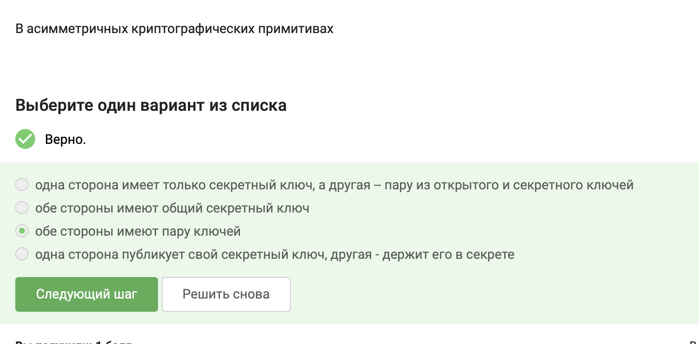

В асимметричной криптографии у каждой стороны есть своя пара ключей: открытый (публичный) и закрытый (секретный). Открытый ключ передаётся другой стороне, закрытый хранится в тайне. При обмене данными одна сторона шифрует открытым ключом другой, а та расшифровывает своим закрытым.

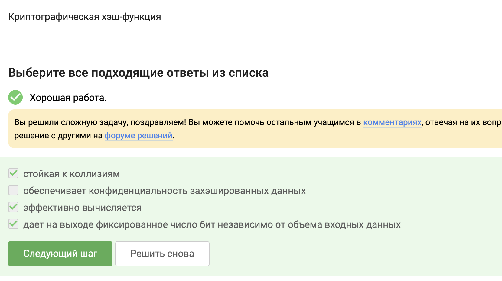

стойкая к коллизиям — невозможно найти два разных входных блока с одинаковым хэшем
эффективно вычисляется — хэш можно быстро посчитать для любого входных данных
фиксированное число бит на выходе — например, SHA-256 всегда даёт 256 бит, хоть для слова "a", хоть для 10 ГБ файла
"обеспечивает конфиденциальность защищаемых данных" — НЕВЕРНО. Хэш-функция не шифрует, не сохраняет конфиденциальность. Из хэша нельзя восстановить исходные данные (однако это свойство не является гарантией конфиденциальности, коллизионная стойкость — это про другое).

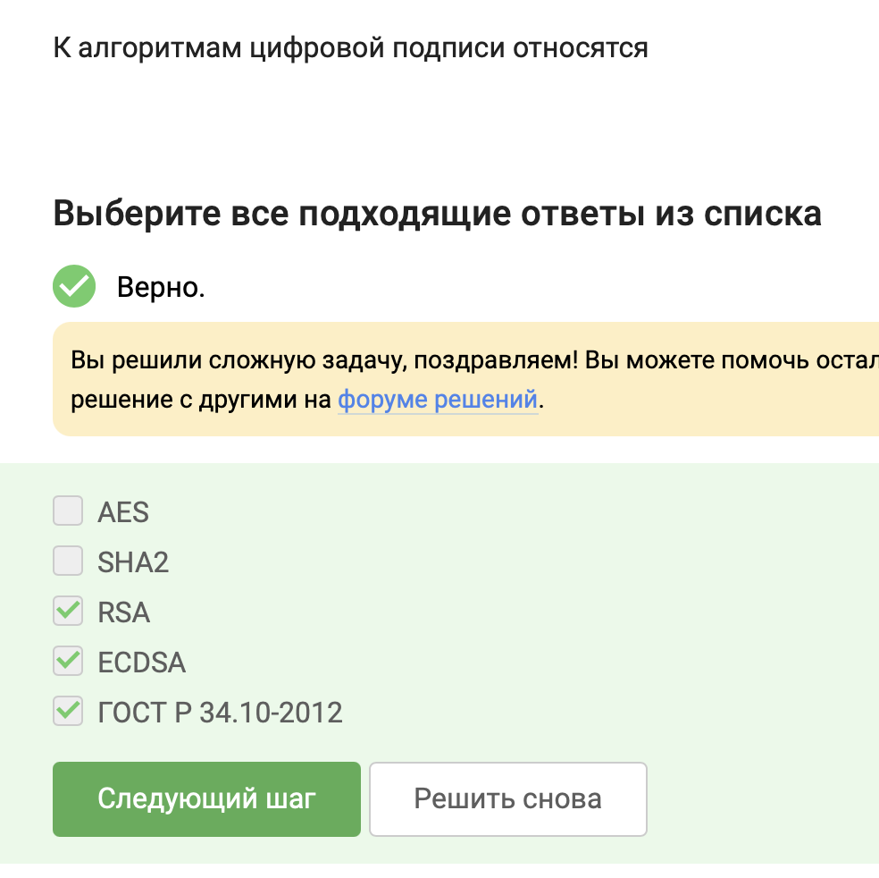

RSA — может использоваться для цифровой подписи (RSA-PSS, RSASSA-PKCS1-v1_5)
ECDSA — алгоритм цифровой подписи на эллиптических кривых
ГОСТ Р 34.10-2012 — российский стандарт цифровой подписи
Не подходят:

AES — алгоритм симметричного шифрования, не для подписи
SHA2 — криптографическая хэш-функция, используется в схемах подписи (как часть), но сама по себе не является алгоритмом цифровой подписи

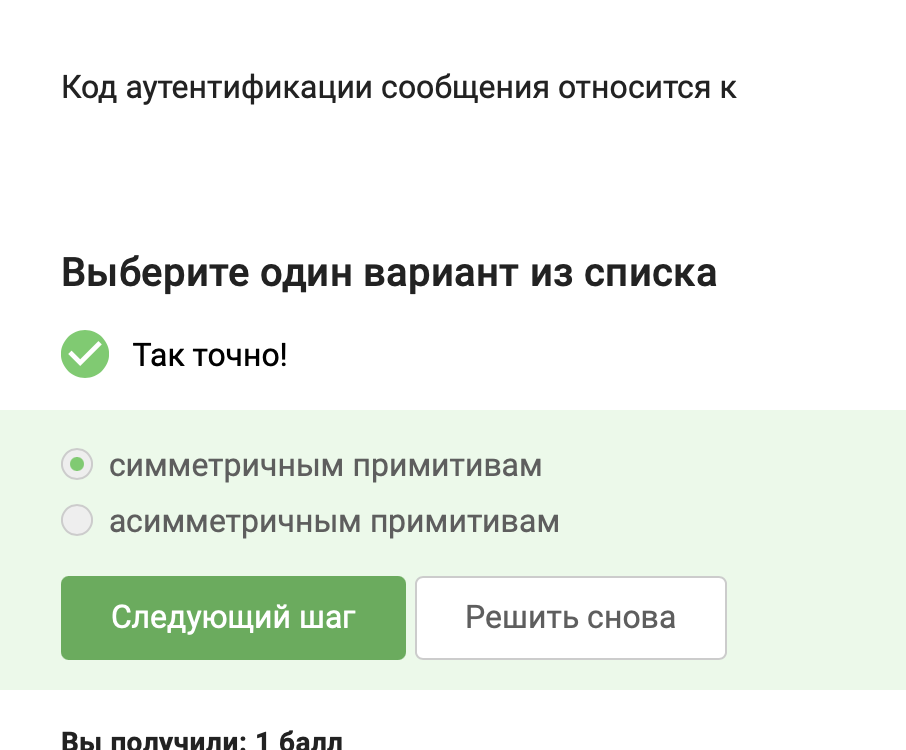

MAC (Message Authentication Code) использует один секретный ключ для вычисления метки аутентификации, который известен и отправителю, и получателю. Это симметричный подход. Для проверки подлинности сообщения нужен тот же ключ, что и для создания метки. Асимметричные примитивы для этого используют цифровую подпись (разные ключи для подписи и проверки).

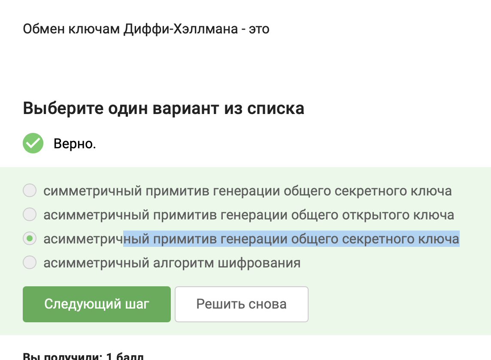

Протокол Диффи-Хэллмана (DH) использует открытые компоненты (публичные ключи), которые стороны обменивают через незащищённый канал, и личные секретные ключи. На выходе получается общий секретный ключ, который затем используется для симметричного шифрования. Это не шифрование данных (не сам алгоритм шифрования) и не генерация открытого ключа. Асимметричный — потому что стороны не имеют одного секретного ключа заранее (разные закрытые компоненты). Результат — секретный (один и тот же у обеих сторон).

### Цифровая подпись

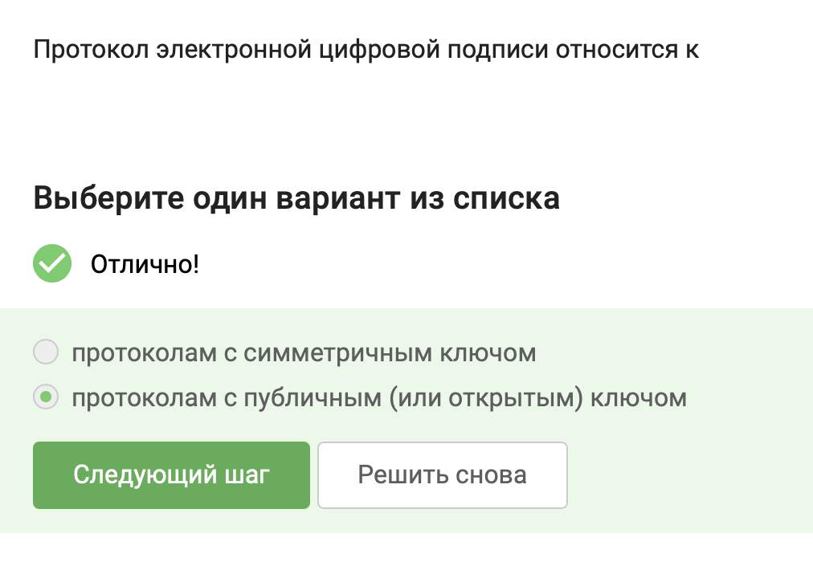

ЭЦП использует асимметричную криптографию. Подпись создаётся с помощью секретного (закрытого) ключа, а проверяется с помощью открытого (публичного) ключа. Это принципиально отличается от симметричных протоколов, где и для создания, и для проверки используется один и тот же секретный ключ.

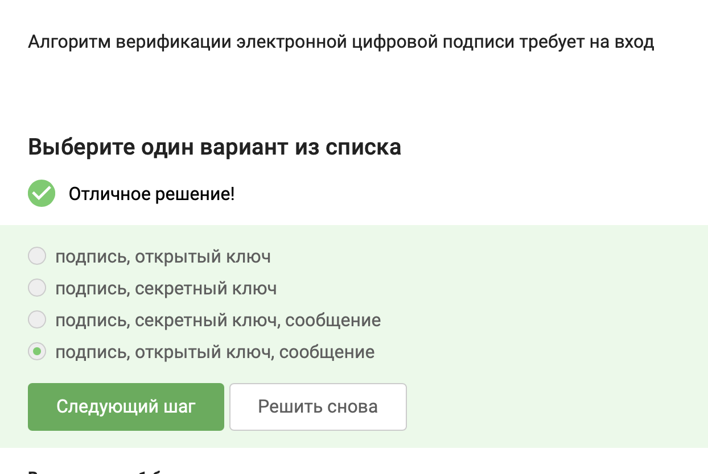

Чтобы проверить подлинность подписи, нужны:

подпись (то, что создал отправитель)
сообщение (к которому привязана подпись)
открытый ключ отправителя (чтобы проверить, что подпись соответствует сообщению и создана именно этим закрытым ключом)
Секретный ключ при верификации не используется — он нужен только для создания подписи.

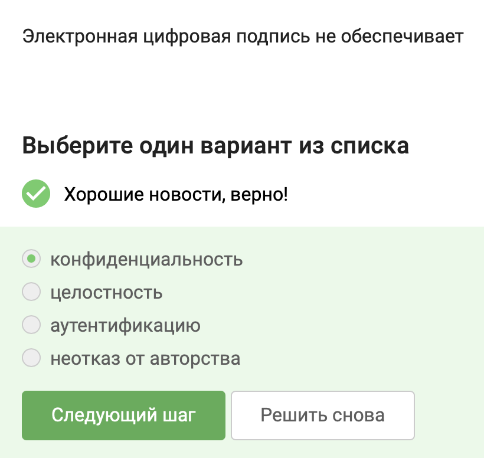

ЭЦП обеспечивает:

целостность — подпись не совпадёт, если сообщение изменили
аутентификацию — можно установить, кто подписал сообщение
неотказ от авторства — отправитель не сможет отрицать, что подписал именно это сообщение
Конфиденциальность (защита от прочтения третьими лицами) ЭЦП не даёт. Подписанное сообщение передаётся в открытом виде или шифруется отдельно (например, гибридной схемой). ЭЦП отвечает за подлинность и целостность, а не за секретность.

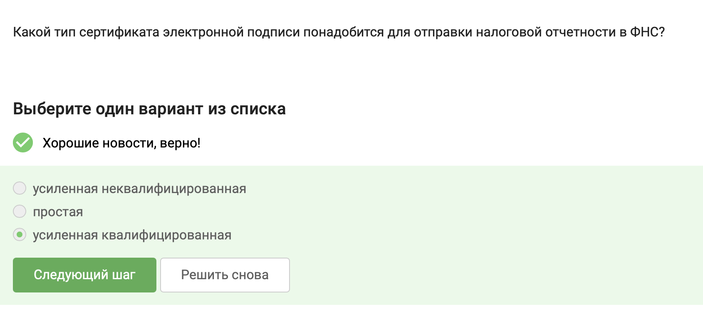

По законодательству РФ, для отправки отчётности в госорганы (ФНС, ПФР, Росстат и т.д.) требуется усиленная квалифицированная электронная подпись (КЭП). Она создаётся с использованием средств криптографической защиты (СКЗИ), прошедших сертификацию ФСБ, а ключи проверки содержатся в квалифицированном сертификате, выпущенном аккредитованным удостоверяющим центром.

Простая подпись (пароль, код из SMS) — не подходит для юридически значимого документооборота с госорганами. Усиленная неквалифицированная — используется для внутреннего документооборота компаний, но не для ФНС.

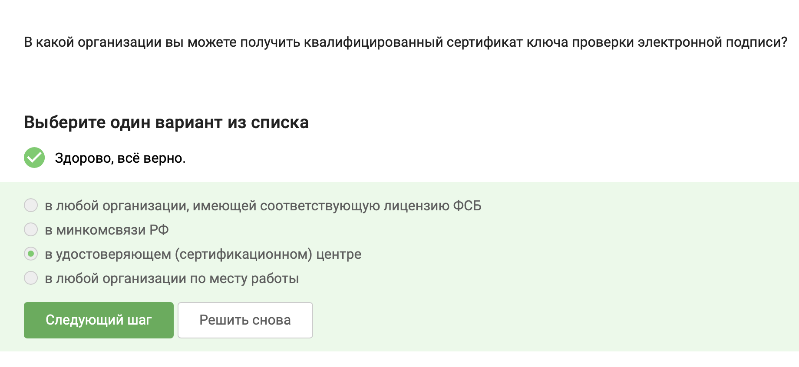

Квалифицированные сертификаты выдаются только аккредитованными удостоверяющими центрами (УЦ). Они имеют лицензию ФСБ на деятельность по выпуску сертификатов ключей проверки электронных подписей.

### Электронные платежи

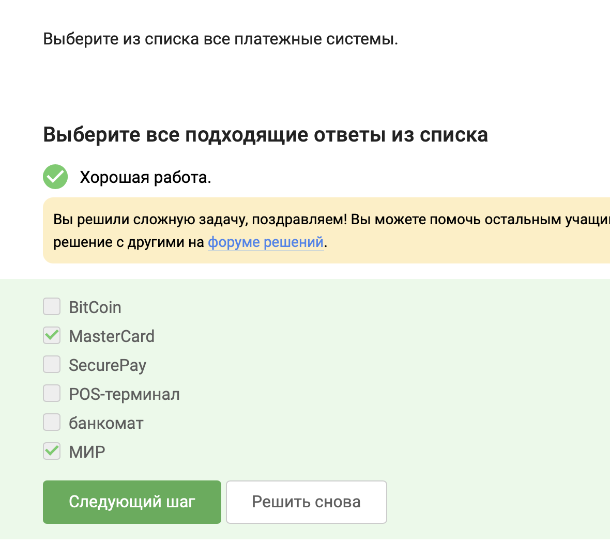

Платёжная система — это совокупность правил, процедур и технической инфраструктуры для осуществления переводов денег между участниками (банками, продавцами, покупателями).

MasterCard — международная платёжная система
МИР — национальная платёжная система России

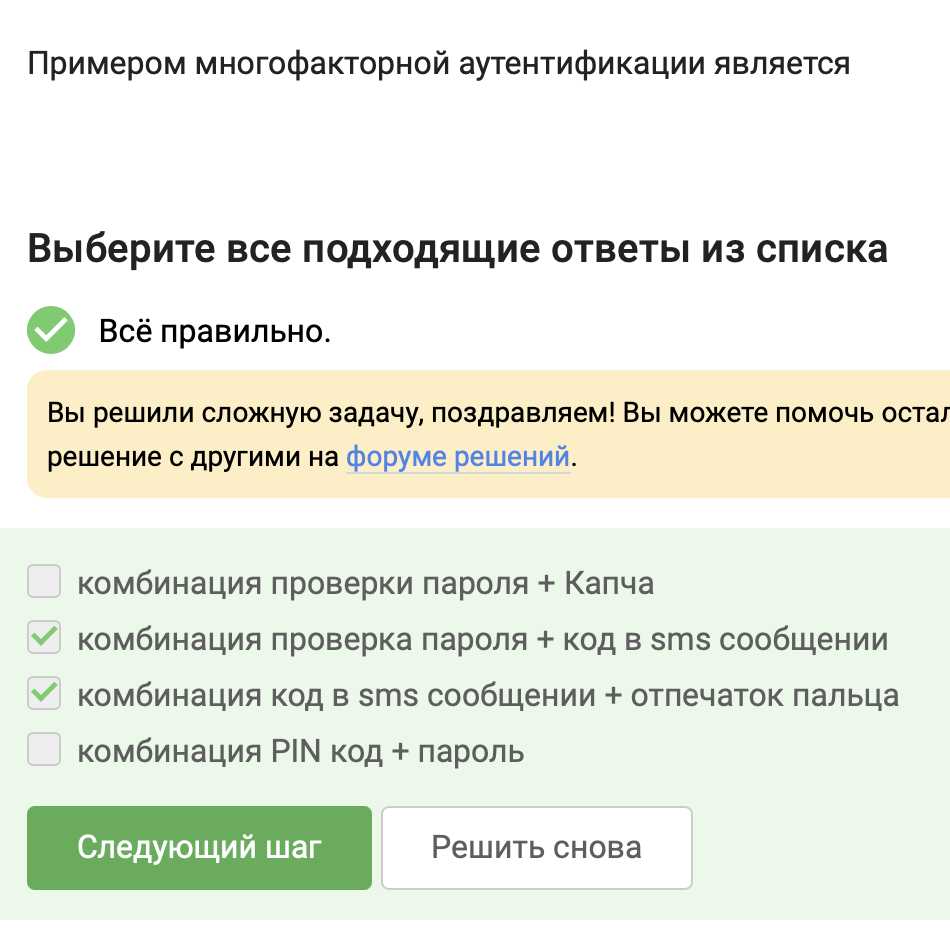

Многофакторная аутентификация (MFA) использует два и более факторов из разных категорий:

Знание — пароль, PIN-код
Владение — телефон (SMS-код), токен, банковская карта
Свойство — отпечаток пальца, Face ID, голос

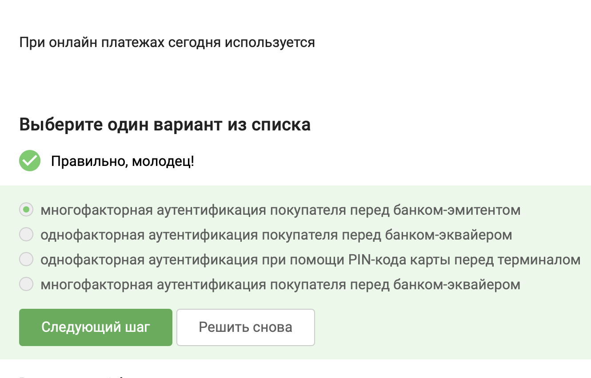

При онлайн-платежах действует стандарт 3D Secure (Verified by Visa, Mastercard SecureCode, Мир Accept). Покупатель проходит дополнительную проверку перед банком-эмитентом (банком, выпустившим карту). Обычно это ввод пароля, полученного в SMS, или подтверждение в мобильном приложении банка. Это многофакторная аутентификация (знание пароля + владение телефоном).

### Блокчейн

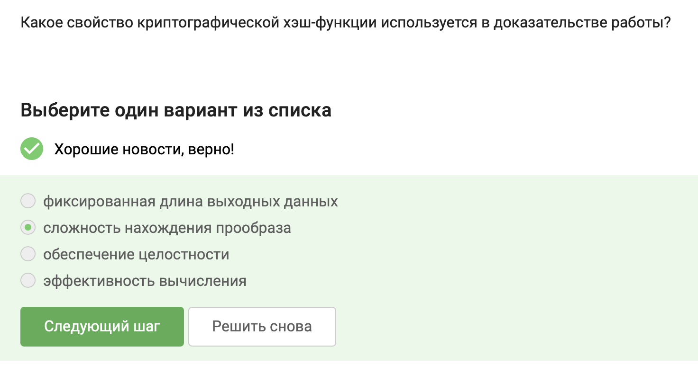

Proof of Work (PoW), используемый в Bitcoin и других блокчейнах, требует найти такое значение nonce, чтобы хэш от заголовка блока был меньше целевого порога (начинался с определённого количества нулей). Это основано на свойстве однонаправленности (сложности нахождения прообраза, pre-image resistance): зная хэш, невозможно быстро подобрать входное значение, дающее этот хэш (кроме полного перебора). Майнеры перебирают миллиарды вариантов, пока не найдут подходящий.

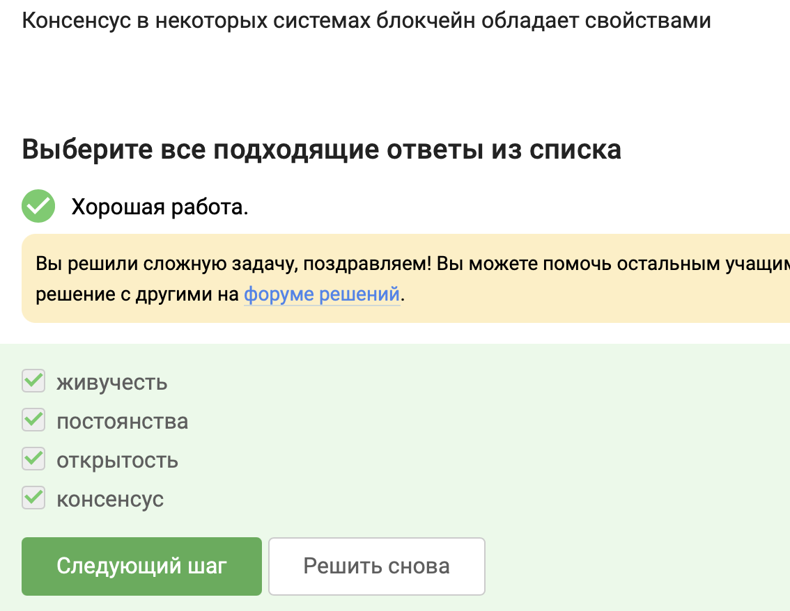

В контексте блокчейна и распределённых систем консенсус обладает следующими ключевыми свойствами:

Живучесть (liveness) — система продолжает работать, новые блоки добавляются, транзакции подтверждаются, даже если некоторые узлы вышли из строя.
Постоянства (finality / согласованность) — подтверждённые данные становятся необратимыми, вероятность их отмены стремится к нулю (особенно в блокчейнах с финализацией, например, в Proof-of-Stake или после нескольких подтверждений в Bitcoin).
Открытость — обычно означает, что любой желающий может присоединиться к сети, участвовать в валидации или проверять транзакции (особенно в публичных блокчейнах).

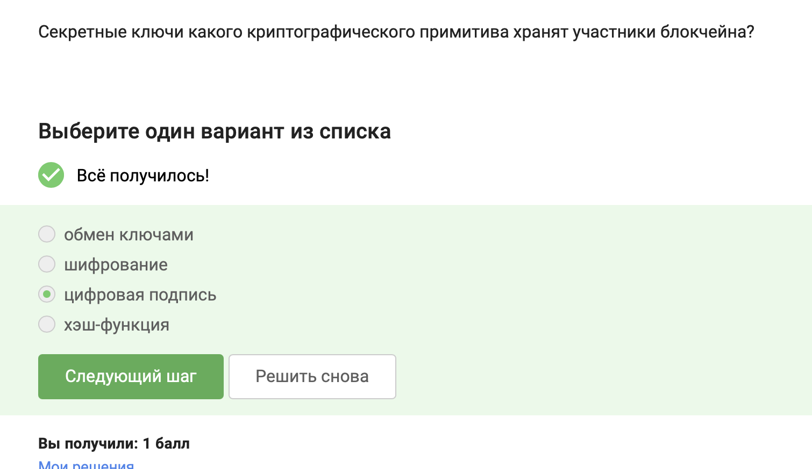

В блокчейне каждый участник имеет пару ключей: закрытый (секретный) и открытый. Закрытый ключ используется для создания цифровой подписи под транзакцией. Подпись подтверждает, что владелец закрытого ключа (тот, кому принадлежат средства) действительно разрешает перевод. Открытый ключ (или адрес, полученный из него) используется для проверки подписи и идентификации получателя.
